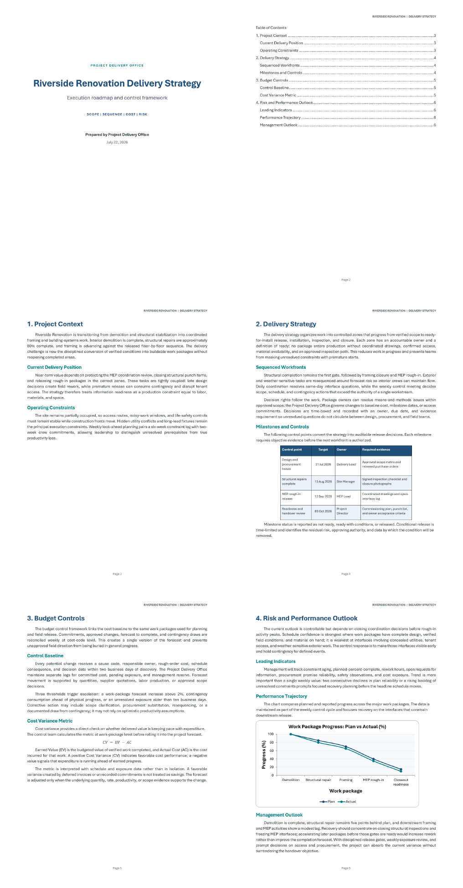
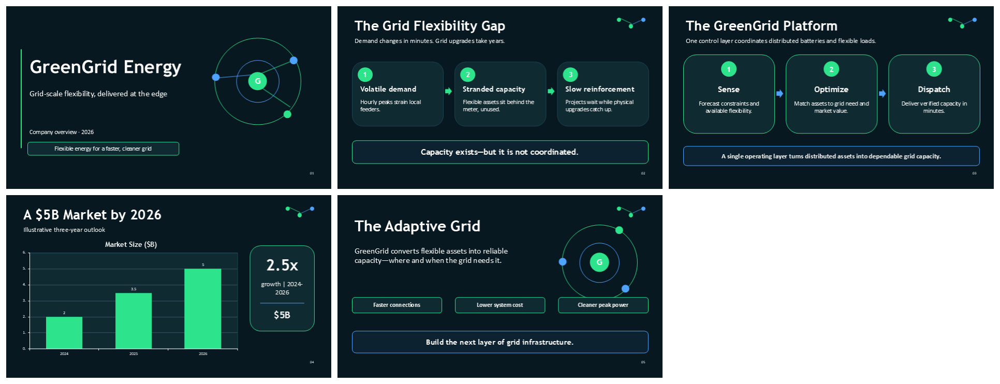
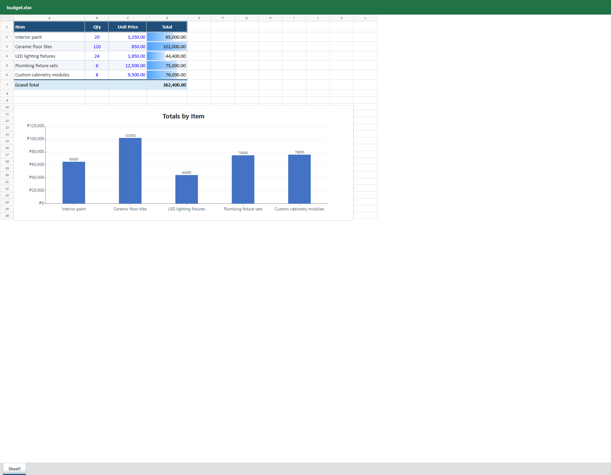

# Ogent — an office agent

Ogent is a tested Windows desktop workflow for creating and editing real Word, Excel, and PowerPoint files through **AionUi**, **Codex CLI**, and **OfficeCLI**.

This repository preserves the completed workstation test suite, reusable Office document templates, native-render QA evidence, and the exact operating workflow used to validate the setup.

Ogent is open source under the [MIT License](LICENSE).

## Install Ogent

Ogent is not a separate executable. It is a tested Windows workspace that connects **AionUi** (desktop interface), **Codex CLI** (AI agent), **OfficeCLI** (Office document engine), and this repository's templates and verification assets.

### Option 1 — Let an AI agent install it (recommended)

Paste this single sentence into Codex or another local AI agent that has permission to run PowerShell and install applications:

```text
Install and configure Ogent on this Windows PC from https://github.com/ljdstechva/ogent-an-office-agent: read the repository README and AGENTS.md first; detect the machine architecture; reuse compatible tools that are already installed; install or update Git, OpenAI Codex CLI, OfficeCLI, and AionUi only from their official sources; verify published hashes or signatures before running downloaded installers; clone or update the repository; have me complete any unavoidable Windows elevation or ChatGPT sign-in without asking me to paste secrets into chat; make sure AionUi detects Codex CLI; detect Microsoft Word 2016 or later for PDF Reflow and, if Word is unavailable, install LibreOffice from its official source as the PDF fallback; open the repository's aionui-tests folder as the workspace; configure a single Codex CLI conversation using GPT-5.6-Sol with medium reasoning and Agent permission mode when available, keep max reasoning as a manual option only for difficult work, and otherwise select the best available Codex model and report the fallback; never create a team or subagent for document work; run version checks; use AionUi and Codex to create smoke-test.local.docx with OfficeCLI; validate it and inspect its text and issues without rendering; and finish only after the complete Word workflow succeeds, reporting the installed versions, paths, and any remaining limitation.
```

The prompt intentionally leaves sign-in and Windows elevation with the human. It also tells the agent to use official sources and verify installers instead of trusting an arbitrary download.

### Option 2 — Human install on Windows

These steps install the latest stable releases. The versions in the verified-workstation section below are the versions used for this repository's recorded test run.

1. Install [Git for Windows](https://git-scm.com/install/windows), then open a new PowerShell window:

   ```powershell
   winget install --id Git.Git -e --source winget
   git --version
   ```

2. Clone Ogent into a folder you control:

   ```powershell
   git clone https://github.com/ljdstechva/ogent-an-office-agent.git
   Set-Location '.\ogent-an-office-agent'
   ```

3. Install [OpenAI Codex CLI](https://github.com/openai/codex), verify it, and sign in interactively with ChatGPT:

   ```powershell
   powershell -ExecutionPolicy ByPass -c "irm https://chatgpt.com/codex/install.ps1 | iex"
   codex --version
   codex
   ```

   Choose **Sign in with ChatGPT** when Codex opens. Do not put an API key or login token in this repository.

4. Install [OfficeCLI](https://github.com/iOfficeAI/OfficeCLI) and verify that it is on `PATH`:

   ```powershell
   irm https://raw.githubusercontent.com/iOfficeAI/OfficeCLI/main/install.ps1 | iex
   officecli --version
   ```

5. Download AionUi from its [official GitHub Releases page](https://github.com/iOfficeAI/AionUi/releases). Choose the Windows `.exe` matching your computer (`x64` for most PCs or `arm64` for Windows on ARM), compare its published SHA-256 with PowerShell, and then run the installer:

   ```powershell
   Get-FileHash '.\AionUi-<version>-win-<architecture>.exe' -Algorithm SHA256
   ```

   PDF conversion uses Microsoft Word 2016 or later when available. If this
   computer does not have Word, install [LibreOffice from its official
   download page](https://www.libreoffice.org/download/download-libreoffice/)
   as the automatic fallback. LibreOffice PDF import is less editable than
   Word PDF Reflow.

6. Launch AionUi and configure Ogent:

   - Select the detected **Codex CLI** agent.
   - Select **GPT-5.6-Sol · medium** when available; use **max** manually only for genuinely difficult reasoning. Otherwise use the best Codex model offered by your account.
   - Select **Agent** permission mode.
   - Open the cloned repository and set its `aionui-tests` folder as the workspace.

7. In AionUi, send this smoke-test prompt:

   ```text
   Work single-agent; do not spawn a team or subagent. Using OfficeCLI, create smoke-test.local.docx with a Heading 1 title named "Ogent smoke test", one short body paragraph, and a live page-number footer; then close it, validate it, and inspect its text and issues without rendering.
   ```

8. From the repository root, confirm the generated file independently:

   ```powershell
   officecli validate '.\aionui-tests\smoke-test.local.docx'
   officecli view '.\aionui-tests\smoke-test.local.docx' issues
   ```

The `*.local.*` filename keeps the smoke-test file out of Git. Microsoft Office is optional for core OfficeCLI work, but Word, Excel, and PowerPoint are recommended for final native review and field refresh. Word or LibreOffice is required for the PDF conversion workflow. If AionUi does not detect Codex, restart AionUi after confirming that `Get-Command codex` succeeds in a new PowerShell window.

## Verified workstation

- Windows 11
- AionUi 2.1.39
- OfficeCLI 1.0.140
- Codex CLI 0.144.1
- AionUi engine: GPT-5.6-Sol; medium is the recommended day-to-day default, with max available manually
- Native Microsoft Word, Excel, and PowerPoint rendering

All 13 included Office test artifacts pass OpenXML validation. See [TEST-REPORT.md](TEST-REPORT.md) for the evidence matrix and [AIONUI-WORKFLOW.md](AIONUI-WORKFLOW.md) for daily use.

## What Ogent demonstrates

- Word reports with cover pages, live tables of contents, styles, headers, footers, page fields, tables, charts, and equations
- Excel workbooks with real formulas, evaluated totals, formatting, conditional formatting, and native charts
- PowerPoint decks with consistent themes, backgrounds, editable shapes, and charts
- AionUi file attachment for round-trip Office editing and CSV-to-Excel conversion (operator-attested; no AionUi screen capture is published)
- Web research converted into a concise, cited Word brief
- Safe PDF-to-DOCX editing and PDF re-export with scanned-file detection
- An honest Visio capability check plus a working native Word diagram alternative
- Replayable JSON templates for common report, deck, and budget workflows

## Visual QA

### Flagship Word report



### PowerPoint deck



### Excel budget workbook



## Repository structure

```text
.
├── README.md
├── LICENSE
├── AGENTS.md
├── AIONUI-WORKFLOW.md
├── TEST-REPORT.md
├── tools/
│   ├── pdf2docx.ps1
│   └── docx2pdf.ps1
├── templates/
│   ├── report-with-toc.json
│   ├── basic-deck.json
│   └── budget-workbook.json
└── aionui-tests/
    ├── baseline-batches/
    ├── *.docx / *.xlsx / *.pptx
    ├── *-batch.json
    └── *-qa.png
```

Installers, local logs, internal agent state, and machine-local source documents are intentionally excluded from version control.

All company, project, budget, and sales names or values in the demo Office artifacts are fictional or synthetic. The community-solar brief is a research demonstration and cites its external sources directly.

## Replay a template

From PowerShell with OfficeCLI installed:

```powershell
officecli create '.\new-report.docx'
officecli batch '.\new-report.docx' --input '.\templates\report-with-toc.json' --stop-on-error
officecli close '.\new-report.docx'
officecli refresh '.\new-report.docx'
officecli validate '.\new-report.docx'
```

Use `basic-deck.json` with a `.pptx` file or `budget-workbook.json` with an `.xlsx` file in the same way. Replace bracketed placeholders after replay, close the OfficeCLI resident before opening the file in Microsoft Office, and validate again after editing.

Choose a new output filename. The examples intentionally avoid overwriting an existing document.

## Edit a PDF safely

Ogent never overwrites or edits an original PDF directly. Copy the PDF, convert
the copy to DOCX, edit and validate the DOCX with OfficeCLI, then export a new
PDF:

```powershell
powershell -NoProfile -ExecutionPolicy Bypass -File '.\tools\pdf2docx.ps1' -Pdf '.\input-copy.pdf' -OutDocx '.\working.docx'
$env:OFFICECLI_NO_AUTO_RESIDENT = '1'
officecli view '.\working.docx' text
# Make the requested OfficeCLI edit, then verify both the new and old text.
officecli query '.\working.docx' 'p:contains("<new text>")'
officecli query '.\working.docx' 'p:contains("<old text>")'
officecli validate '.\working.docx'
powershell -NoProfile -ExecutionPolicy Bypass -File '.\tools\docx2pdf.ps1' -Docx '.\working.docx' -OutPdf '.\edited.pdf'
```

Word PDF Reflow is the preferred conversion engine. LibreOffice is the
automatic fallback. Image-only PDFs stop with `[SCANNED_PDF]` because they
need OCR. Complex columns, embedded fonts, and floating graphics can reflow,
so verify content and structure first; request one final rendered comparison or
edit the original design file when pixel-perfect fidelity is required. See [AIONUI-WORKFLOW.md](AIONUI-WORKFLOW.md)
for the complete agent workflow.

## Visio note

OfficeCLI 1.0.140 supports `.docx`, `.xlsx`, and `.pptx`, but not `.vsdx`. Ogent demonstrates a native editable Word drawing as the current alternative. A future OfficeCLI format-handler plugin or a separate Python `vsdx` workflow could add real Visio output.

## Safety and provenance

- No credentials, API keys, cookies, or tokens are stored in this repository.
- No installer binaries are committed.
- Machine-local source documents used during workstation setup are excluded; their integrity checks remain local and are not published.
- Research sources and execution deviations are documented in [TEST-REPORT.md](TEST-REPORT.md).

## License

Copyright © 2026 ljdstechva. Released under the [MIT License](LICENSE).
