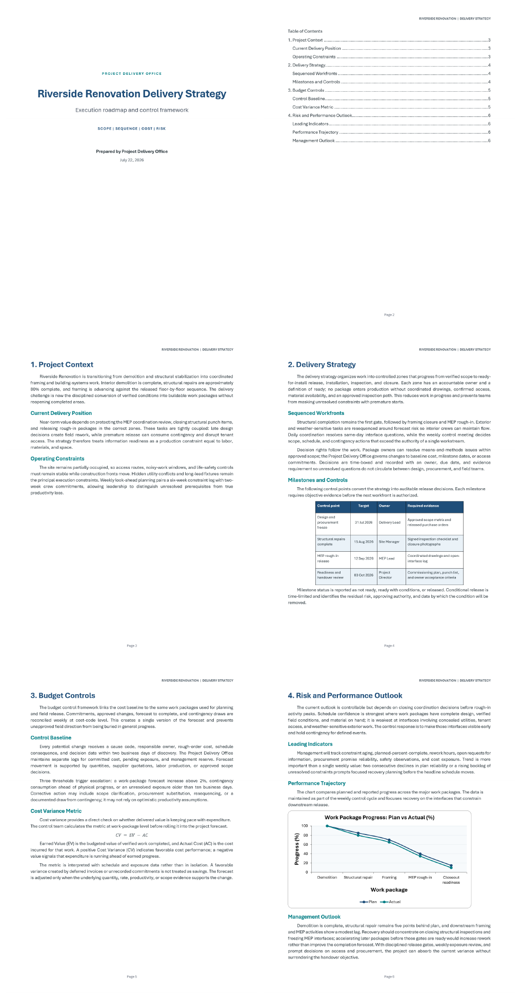
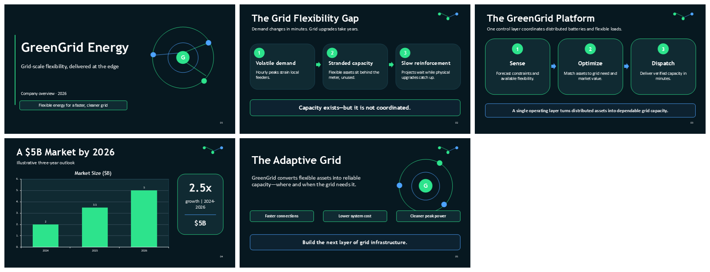
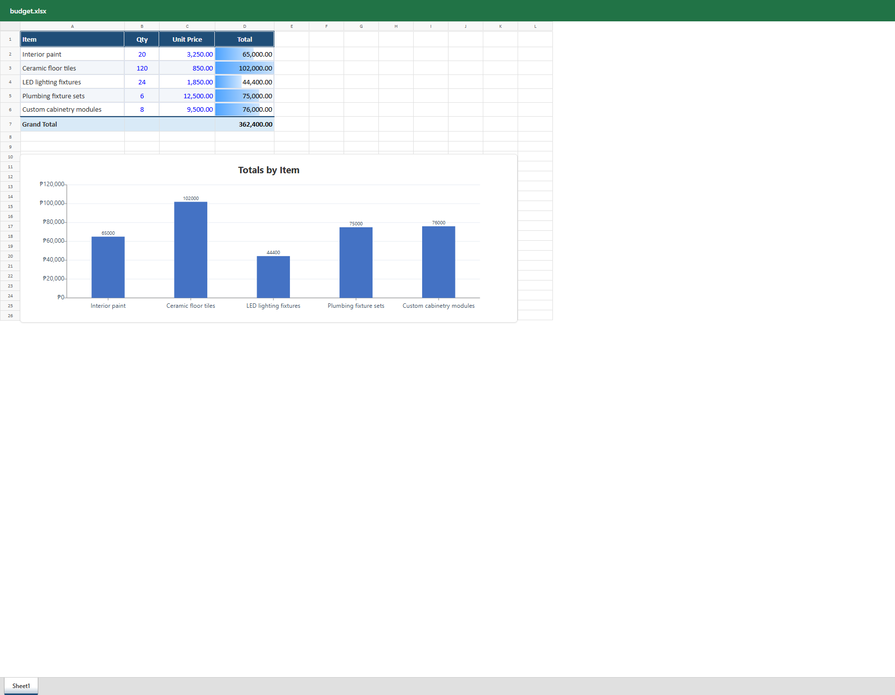

<p align="center">
  
</p>

# Ogent — an office agent

Ogent is a local Windows workspace for editing real Word, Excel, and PowerPoint
files with plain-language instructions. It places an OfficeCLI live preview
beside a Codex or Claude Code chat, runs on `127.0.0.1`, and creates a
protected working copy before any edit touches a document.

The current app is **Ogent Lite 0.9.0**. It uses the selected CLI's existing
sign-in and never asks you to enter an OpenAI or Anthropic API key. Ogent is
open source under the [MIT License](LICENSE).

## Install Ogent

### Option 1 — Let an AI agent install it (recommended)

Copy and paste this one sentence into Codex or another local AI agent that can
run PowerShell:

```text
Install and configure Ogent on this Windows 11 PC from https://github.com/ljdstechva/ogent-an-office-agent: read the repository README and AGENTS.md first; preserve unrelated files and reuse compatible tools already installed; install or update Git, Python 3, OfficeCLI, and at least one supported agent CLI—OpenAI Codex CLI, Anthropic Claude Code, or both—only from their official sources; verify downloaded installers or scripts before running them; clone or fast-forward the repository into a folder I control; install the pinned packages from ogent-lite\requirements.txt; let me complete any unavoidable Windows elevation or interactive provider sign-in without asking me to paste passwords, tokens, or API keys into chat; verify py -3, git, officecli, and every installed agent CLI; discover the models and effort choices available to my signed-in account from each CLI at runtime instead of hard-coding names, using Codex App Server model/list with the installed CLI's dynamic fallback and Claude Code's zero-inference /model and help probes, and report any provider that cannot be verified; from the ogent-lite folder register the per-user Open in Ogent shell command, create or refresh an Ogent desktop shortcut targeting ogent.cmd with assets\ogent.ico, launch Ogent, and verify that its health endpoint reports version 0.9.0; confirm that Agent, Model, and Effort selectors show only live CLI-reported choices and that stale or unavailable choices cannot start a run; drag disposable DOCX, XLSX, PPTX, and searchable PDF files into the browser and one DOCX onto the desktop shortcut; attach disposable Office, PDF, text, and image files at the chat composer and confirm they remain read-only, work with and without an active document, use an isolated non-resumable provider context, and are deleted after each run; run one protected-copy Office edit with each installed provider, verify valid Office output and unchanged source hashes, then verify the session switcher, provider isolation, live preview, Word view, Stop, automatic tab cleanup, and right-click integration; leave the right-click integration enabled; and finish by reporting installed versions, discovered model/effort evidence, paths, test results, and any remaining limitation without committing or pushing unless I explicitly request it.
```

The prompt deliberately leaves sign-in and elevation with the human and never
asks for a password, token, or API key.

### Option 2 — Human install on Windows

1. Install [Git for Windows](https://git-scm.com/install/windows) and
   [Python 3](https://www.python.org/downloads/windows/), then open a new
   PowerShell window:

   ```powershell
   git --version
   py -3 --version
   ```

2. Clone Ogent into a folder you control:

   ```powershell
   git clone https://github.com/ljdstechva/ogent-an-office-agent.git
   Set-Location '.\ogent-an-office-agent'
   ```

3. Install the pinned PDF and image packages:

   ```powershell
   py -3 -m pip install -r '.\ogent-lite\requirements.txt'
   ```

4. Install and sign in to at least one supported agent CLI. You may install
   both and switch between them without reopening the document.

   For [OpenAI Codex CLI](https://github.com/openai/codex):

   ```powershell
   powershell -ExecutionPolicy ByPass -c "irm https://chatgpt.com/codex/install.ps1 | iex"
   codex --version
   codex login
   ```

   For [Claude Code](https://docs.anthropic.com/en/docs/claude-code/getting-started):

   Install Node.js 18 or later first. Native Windows Claude Code also uses Git
   for Windows, which was installed in step 1.

   ```powershell
   npm install -g @anthropic-ai/claude-code
   claude --version
   claude auth login
   ```

5. Install [OfficeCLI](https://github.com/iOfficeAI/OfficeCLI):

   ```powershell
   irm https://d.officecli.ai/install.ps1 | iex
   officecli --version
   ```

6. Register **Open in Ogent** for your Windows account and launch the app:

   ```powershell
   Set-Location '.\ogent-lite'
   py -3 .\ogent.py --register-shell
   .\ogent.cmd
   ```

   Your browser opens the local app, normally at
   `http://127.0.0.1:8765/`. No AionUi installation or OfficeCLI MCP call is
   required: Ogent invokes the selected agent CLI and OfficeCLI automatically.

The Explorer command appears under **Right-click > Show more options > Open in
Ogent** for `.docx`, `.xlsx`, and `.pptx`. Ogent requests Windows' `Top`
placement, so the command joins the upper classic-menu cluster with Open/Edit
rather than sitting below Print. Windows exposes only Top/Bottom placement; it
does not let an app pin itself between two exact neighbors. Registration is
per-user and does not require administrator rights.

Microsoft Office is optional for normal DOCX/XLSX/PPTX editing. PDF import uses
Microsoft Word 2016 or later when available, with
[LibreOffice](https://www.libreoffice.org/download/download-libreoffice/) as a
less precise fallback.

### Optional desktop shortcut

Run this once from the `ogent-lite` folder:

```powershell
$ogentDir = (Resolve-Path '.').Path
$desktopDir = [Environment]::GetFolderPath('Desktop')
$shortcutShell = New-Object -ComObject WScript.Shell
$shortcut = $shortcutShell.CreateShortcut((Join-Path $desktopDir 'Ogent.lnk'))
$shortcut.TargetPath = Join-Path $ogentDir 'ogent.cmd'
$shortcut.WorkingDirectory = $ogentDir
$shortcut.IconLocation = (Join-Path $ogentDir 'assets\ogent.ico') + ',0'
$shortcut.Save()
```

After that, double-click **Ogent** whenever you want to start or return to the
app. You can also drag one supported file onto the shortcut to launch
Ogent with that file immediately.

## Use Ogent

### Edit an existing document

1. Drag a `.docx`, `.xlsx`, `.pptx`, or `.pdf` anywhere into the Ogent window.
   You can also click the drop area to choose a file, drag a supported
   file onto the desktop shortcut, right-click an Office file and select
   **Open in Ogent**, or paste its absolute path and click **Open**.
2. Choose a ready provider, then choose a model and effort reported by its
   installed CLI. Click **Refresh** after signing in, changing account or
   policy, or upgrading a CLI. **Automatic — CLI default** omits the effort
   override.
3. Describe the change in plain language and press **Enter**.
4. Review each change in the live preview. Ogent asks the selected agent to use
   OfficeCLI, read the result back, and validate the working document.
5. For a DOCX with floating shapes or textboxes, click **Word view** for an
   on-demand PDF rendered by Microsoft Word. The normal live preview stays
   faster and editable; Word view is the layout-accurate verification surface.

### Choose an agent, model, and effort

Ogent does not ship a static model list. At startup and when **Refresh** is
clicked, it asks each installed CLI for the models and effort choices available
to the current signed-in account. Codex uses App Server `model/list`, with the
installed CLI's dynamic fallback. Claude Code uses a local zero-inference
`/model` query and help/probe checks, so discovery does not consume an inference
turn. If model-specific probing is structurally unsupported, Claude's global
CLI-valid efforts remain visibly labeled as model-specific support unverified.

The last successful catalog is cached only to keep the interface understandable
while refreshing. A stale catalog cannot start a run. Changing a model starts a
fresh provider context; switching between Codex and Claude keeps their session
identifiers separate.

### Analyze temporary chat references

Use the paperclip or drop files directly on the chat composer to attach
temporary, read-only evidence. This is intentionally different from dropping a
file elsewhere in Ogent: a whole-page drop opens a protected editable working
copy, while a composer drop never replaces the active document, changes the
preview, starts an OfficeCLI watch, or enters recent-document history.

One run can use up to five references, 50 MB each and 100 MB combined. Supported
types are DOCX, XLSX, PPTX, PDF, TXT, Markdown, CSV, PNG, JPEG, WebP, BMP, and
TIFF; each PDF is limited to 25 pages. Ogent validates actual content, not just
the extension. Empty, malformed, mismatched, executable, archive, legacy Office,
or over-limit files are rejected without leaving a usable attachment.

Send references with a request, or press **Send** with an empty message to ask
for a summary. The selected set is frozen into that run; references attached
while it works stay in the tray for the next run. Searchable PDF text retains
page headings. Scanned or low-text PDF pages, images, and visually requested
Office content are supplied only to the selected provider for that run.

References and derived text, page images, and manifests live only under
`%LOCALAPPDATA%\OgentLite\temporary-references\`. Ogent normally deletes the
run directory after success, error, Stop, preparation failure, session cleanup,
or shutdown, and clears abandoned files on the next startup after a crash.
Deletion is best-effort local deletion, not forensic erasure. **References are
temporary local copies and are deleted after this run. Their contents are sent
to the selected AI provider in a non-resumable context; the provider's own
data-handling policy still applies.**

### Start a new document

Create a blank file first in Word, Excel, PowerPoint, or OfficeCLI, then open it
in Ogent:

```powershell
$newDocument = Join-Path ([Environment]::GetFolderPath('MyDocuments')) 'new-report.docx'
officecli create $newDocument
```

Use `.xlsx` or `.pptx` instead when starting a workbook or presentation.

### Work with several documents

Each newly created Ogent browser workspace gets an independent session with its
own document, OfficeCLI preview port, transcript, provider-specific contexts,
and run state.
Use **+ New window** or launch `ogent.cmd` again to create a second workspace.
Explorer's **Open in Ogent** command targets the most recently focused connected
workspace so its existing tab updates immediately; Ogent also opens that
workspace in a predictable extra tab. The session dropdown switches among every
live workspace.

Different sessions can run agent edits at the same time. Each individual
session still allows only one active run, which prevents two agents from
editing the same working copy concurrently. Codex and Claude keep separate
document-specific contexts; changing model starts a fresh context, while
switching back to a provider may resume its compatible context. Opening the
same source twice focuses its existing session instead of starting a second
watch. If two browser tabs point to that same deduplicated session, they share
its document and chat;
closing only one of them does not orphan the session.

### Keep the finished file

Ogent edits a timestamped copy under
`%LOCALAPPDATA%\OgentLite\work\`; the source file remains untouched. Browser
drag/drop first saves the exact uploaded bytes under
`%LOCALAPPDATA%\OgentLite\imports\`, then creates the separate working copy.
Once the result is approved, stop Ogent and copy the working file to the final
location and filename you want. Validate that final copy before delivery.

### Close tabs and stop the backend

Closing the final browser tab connected to a session marks that session
orphaned. If it stays disconnected and idle, Ogent reaps it after 120 seconds,
stops its OfficeCLI watch, and releases its preview port. A session with an
active provider run is protected until the run finishes, then receives a fresh
120-second reconnect window.

After the last session is gone, the backend exits automatically after 10
minutes. Start it directly with `--idle-exit-minutes 0` to keep it resident, or
choose another non-negative number:

```powershell
py -3 .\ogent.py --idle-exit-minutes 30
```

`ogent.cmd stop` remains the manual stop. If Word view is rendering, shutdown
briefly waits for Word to quit cleanly; a tracked automation-process fallback
prevents a hidden Word instance from being left behind.

### Edit a PDF

Start Ogent, type `Edit my PDF`, and paste the PDF's absolute path. Ogent copies
the PDF, converts the copy to a working DOCX, and opens that DOCX for editing.
The original PDF is never edited. Image-only PDFs stop honestly because they
need OCR; complex layouts may require cleanup after Word PDF Reflow.

## Start, stop, update, and uninstall

From the `ogent-lite` folder:

```powershell
# Start or return to the existing app
.\ogent.cmd

# Stop Ogent, its OfficeCLI preview, and any active provider process it owns
.\ogent.cmd stop
```

To update:

```powershell
.\ogent.cmd stop
Set-Location '..'
git pull --ff-only
Set-Location '.\ogent-lite'
py -3 -m pip install -r '.\requirements.txt'
py -3 .\ogent.py --register-shell
.\ogent.cmd
```

Re-register after moving or renaming the cloned repository because the Explorer
command stores the absolute Ogent path.

To remove the Explorer integration:

```powershell
.\ogent.cmd stop
py -3 .\ogent.py --unregister-shell
```

You may then delete the desktop shortcut and cloned repository. Local working
copies and recent-path history remain under `%LOCALAPPDATA%\OgentLite` until you
remove them.

## How it works

```text
Browser UI (127.0.0.1) -> Ogent server -> selected agent CLI -> OfficeCLI -> protected copy
       one tab/session -----------^                 \-> its own live preview port
       another tab/session ------^
       composer references -> temporary validation/extraction/images -> selected provider
```

- Ogent owns one local server and a registry of independent tab sessions.
  Each session owns its protected copy, transcript, provider-specific contexts,
  run state, and OfficeCLI preview on a port allocated from 26320-26380.
- The installed CLI is the model and effort source of truth. Ogent keeps no
  static provider model catalog and validates every selection server-side.
- Composer references use a separate per-session, per-run store. Only safe
  metadata reaches the browser; paths and derived artifacts stay local and are
  deleted at the terminal boundary.
- OfficeCLI performs and validates the actual Office-file changes.
- AionUi is optional. The earlier AionUi workflow remains documented in
  [AIONUI-WORKFLOW.md](AIONUI-WORKFLOW.md), but it is not required to run the
  Ogent app.

## Verified workstation

- Windows 11
- Ogent Lite 0.9.0
- Python 3.14.3 with pypdfium2 5.12.1 and Pillow 12.1.1
- OfficeCLI 1.0.142
- Codex CLI 0.145.0
- Claude Code 2.1.220
- Live, zero-inference CLI capability discovery for both installed providers
- Native Microsoft Word, Excel, and PowerPoint rendering

The app's browser and full-window drag/drop, composer references, searchable and
scanned PDF analysis, direct image vision, desktop-shortcut drop, multi-session
launch, concurrent protected-copy edits, live previews, same-file dedupe, tab
reaping, crash cleanup, automatic backend exit, Word view,
provider/model/effort selectors, Stop control, PDF import, Explorer integration,
desktop shortcut, and reversible unregister flow were exercised end to end. See
[ogent-lite/OGENT-REPORT.md](ogent-lite/OGENT-REPORT.md) for the app evidence.
The repository's 13 original Office test artifacts also pass OpenXML validation;
see [TEST-REPORT.md](TEST-REPORT.md).

## What Ogent demonstrates

- A local two-pane Ogent app with live Office preview, selectable Codex or
  Claude Code chat, CLI-discovered controls, independent browser-tab sessions,
  and Windows Explorer integration
- Word reports with cover pages, live tables of contents, styles, headers, footers, page fields, tables, charts, and equations
- Excel workbooks with real formulas, evaluated totals, formatting, conditional formatting, and native charts
- PowerPoint decks with consistent themes, backgrounds, editable shapes, and charts
- An optional AionUi workflow for round-trip Office editing and CSV-to-Excel conversion (operator-attested; no AionUi screen capture is published)
- Web research converted into a concise, cited Word brief
- Safe PDF-to-DOCX editing and PDF re-export with scanned-file detection
- An honest Visio capability check plus a working native Word diagram alternative
- Replayable JSON templates for common report, deck, and budget workflows

## Visual QA

### Flagship Word report



### PowerPoint deck



### Excel budget workbook



## Repository structure

```text
.
├── README.md
├── LICENSE
├── AGENTS.md
├── AIONUI-WORKFLOW.md
├── TEST-REPORT.md
├── ogent-lite/
│   ├── ogent.py
│   ├── ogent_references.py
│   ├── ogent.cmd
│   ├── requirements.txt
│   ├── OGENT-REPORT.md
│   └── assets/
├── tools/
│   ├── pdf2docx.ps1
│   ├── docx2pdf.ps1
│   └── office-reference-to-pdf.ps1
├── templates/
│   ├── report-with-toc.json
│   ├── basic-deck.json
│   └── budget-workbook.json
└── aionui-tests/
    ├── baseline-batches/
    ├── *.docx / *.xlsx / *.pptx
    ├── *-batch.json
    └── *-qa.png
```

Installers, local logs, internal agent state, and machine-local source documents are intentionally excluded from version control.

All company, project, budget, and sales names or values in the demo Office artifacts are fictional or synthetic. The community-solar brief is a research demonstration and cites its external sources directly.

## Replay a template

From PowerShell with OfficeCLI installed:

```powershell
officecli create '.\new-report.docx'
officecli batch '.\new-report.docx' --input '.\templates\report-with-toc.json' --stop-on-error
officecli close '.\new-report.docx'
officecli refresh '.\new-report.docx'
officecli validate '.\new-report.docx'
```

Use `basic-deck.json` with a `.pptx` file or `budget-workbook.json` with an `.xlsx` file in the same way. Replace bracketed placeholders after replay, close the OfficeCLI resident before opening the file in Microsoft Office, and validate again after editing.

Choose a new output filename. The examples intentionally avoid overwriting an existing document.

## Edit a PDF safely

Ogent never overwrites or edits an original PDF directly. Copy the PDF, convert
the copy to DOCX, edit and validate the DOCX with OfficeCLI, then export a new
PDF:

```powershell
powershell -NoProfile -ExecutionPolicy Bypass -File '.\tools\pdf2docx.ps1' -Pdf '.\input-copy.pdf' -OutDocx '.\working.docx'
$env:OFFICECLI_NO_AUTO_RESIDENT = '1'
officecli view '.\working.docx' text
# Make the requested OfficeCLI edit, then verify both the new and old text.
officecli query '.\working.docx' 'p:contains("<new text>")'
officecli query '.\working.docx' 'p:contains("<old text>")'
officecli validate '.\working.docx'
powershell -NoProfile -ExecutionPolicy Bypass -File '.\tools\docx2pdf.ps1' -Docx '.\working.docx' -OutPdf '.\edited.pdf'
```

Word PDF Reflow is the preferred conversion engine. LibreOffice is the
automatic fallback. Image-only PDFs stop with `[SCANNED_PDF]` because they
need OCR. Complex columns, embedded fonts, and floating graphics can reflow,
so verify content and structure first; request one final rendered comparison or
edit the original design file when pixel-perfect fidelity is required. See [AIONUI-WORKFLOW.md](AIONUI-WORKFLOW.md)
for the complete agent workflow.

## Visio note

OfficeCLI 1.0.141 supports `.docx`, `.xlsx`, and `.pptx`, but not `.vsdx`. Ogent demonstrates a native editable Word drawing as the current alternative. A future OfficeCLI format-handler plugin or a separate Python `vsdx` workflow could add real Visio output.

## Safety and provenance

- No credentials, API keys, cookies, or tokens are stored in this repository.
- No installer binaries are committed.
- Machine-local source documents used during workstation setup are excluded; their integrity checks remain local and are not published.
- Research sources and execution deviations are documented in [TEST-REPORT.md](TEST-REPORT.md).

## License

Copyright © 2026 ljdstechva. Released under the [MIT License](LICENSE).
